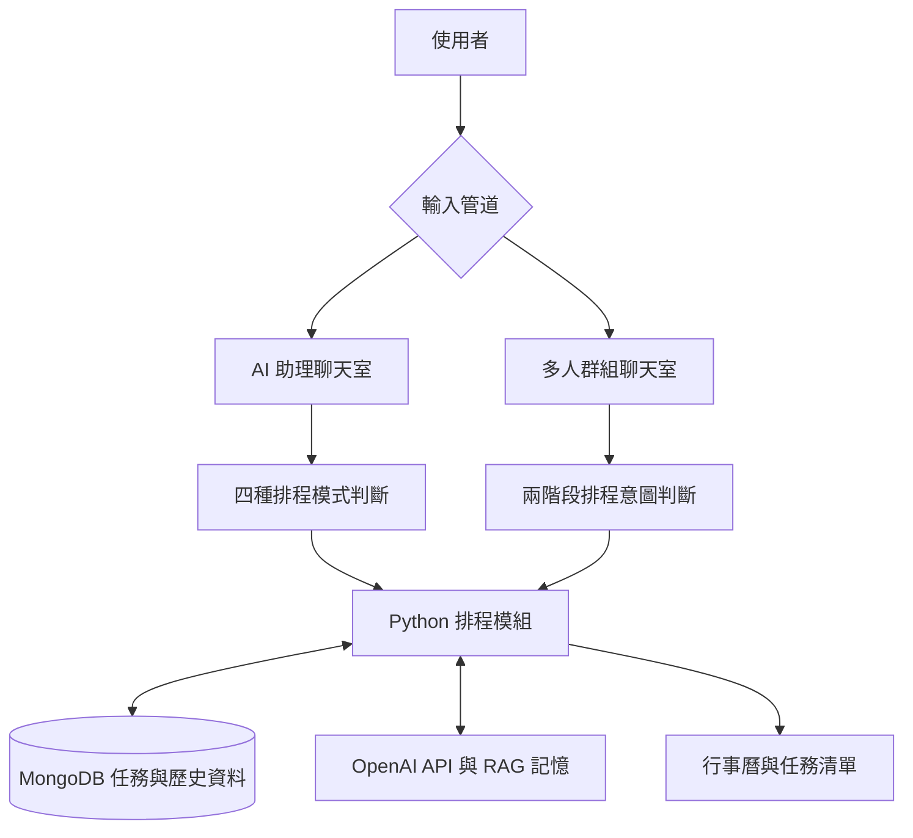

# AI 智慧協作排程系統

> 將群組討論轉換成清楚、可確認的個人行程。

這是我們的大學專題「智慧行程排程代理系統」。系統結合群組即時聊天、AI 助理、行事曆與任務管理，讓使用者可以用自然語言描述想做的事，再由系統辨識排程意圖、整理時間資訊，提供可加入行事曆的建議。

## 專題重點

- 支援建立群組、透過群組 ID 加入群組，以及多人即時聊天。
- 在群組對話中先偵測是否有排程意圖，再擷取實際討論出的時間與任務內容。
- 提供個人 AI 助理聊天室，將「明天讀書 30 分鐘」這類自然語句轉成可確認的任務建議。
- 結合使用者偏好、既有任務、歷史紀錄與 RAG 記憶，推薦較適合的時段。
- 可直接將 AI 建議新增到日曆，並管理任務的新增、編輯、完成與刪除。

## 系統展示

### 建立或加入協作群組

使用者可以建立新的討論空間，或輸入群組 ID 加入既有群組；右側同步顯示個人行事曆與當日任務。


### 多人即時群組聊天

兩個使用者在同一個群組中傳送訊息時，訊息會即時同步到另一個畫面。


### 群組討論與 AI 助理分流

一般群組保留討論脈絡；系統偵測到可能的排程需求後，使用者可在 AI 助理聊天室確認建議，不會直接干擾群組對話。


### AI 產生排程建議

AI 助理會整理任務類型、日期、時間與持續時間，使用者確認後可一鍵新增到任務清單。


### 排程加入日曆與任務清單

確認後，任務會顯示在日曆與當日任務區，後續仍能進行編輯、完成或刪除。


### 持續安排後續任務

系統能在既有任務存在時繼續處理後續需求，避免新的建議與既有行程重疊。

<p align="center">
  
  
</p>

## 系統架構



系統以前端聊天室與行事曆提供互動，Node.js 後端負責帳號、群組、任務與 Socket.IO 即時通訊；Python 模組則處理意圖分類、時間轉換、排程運算與 RAG 檢索。

## AI 判斷與排程方式

| 情境 | 處理方式 |
| --- | --- |
| 明確排程需求 | 例如「明天晚上 7 點讀書 30 分鐘」，先萃取相對時間，再以程式邏輯轉換成正確日期與任務資訊。 |
| 模糊需求且歷史資料足夠 | 依任務類型、歷史時段與 RAG 記憶進行加權，推薦較適合的時間。 |
| 模糊需求且資料不足 | 使用者的可用時間、專注時段與任務偏好表單會成為排程依據，降低冷啟動時的過度推論。 |
| 非排程對話 | 不建立任務，避免一般聊天污染排程資料。 |

群組聊天室採用兩階段處理：第一階段只判斷訊息是否具有排程意圖，第二階段才結合近期聊天紀錄擷取任務細節。這樣能減少每一則一般訊息都進行完整 AI 推論的成本與誤判。

排程演算法會將一天切成 48 個 30 分鐘時段，從使用者的可用時間中建立候選區塊，再依序考慮歷史任務分布、任務類型、專注時段、疲勞成本、RAG 記憶、既有任務衝突與日期使用情形來計分，選出相對合適的建議。這是本專題實作個人化排程的核心。

## 使用技術

| 類別 | 技術 |
| --- | --- |
| 前端 | HTML、CSS、JavaScript |
| 後端 | Node.js、Express |
| 即時通訊 | Socket.IO |
| 資料庫 | MongoDB、Mongoose |
| AI 與排程 | Python、OpenAI API、LangChain、RAG |
| 桌面應用 | Electron |

## 專題資料

為了適合公開放在 GitHub，以下版本已移除原始封面中包含的學號、Email 與老師簽名。

- [專題競賽書面報告公開版](docs/project-documents/project-report-public.pdf)
- [專題競賽簡報公開版](docs/project-documents/project-slides-public.pdf)

原始書面報告說明系統結合 LLM、RAG、Node.js、MongoDB 與 Python，並將群組意圖偵測、四種處理模式與多因子排程演算法作為核心設計；簡報則以系統架構、四種模式、群組兩階段判斷與實機展示整理整體成果。

## 安裝與執行

建議使用 Node.js 20 以上與 Python 3.10 以上。AI 功能需要可用的 OpenAI API Key 與帳戶額度，資料則使用自己的 MongoDB Atlas 連線字串。

1. 安裝 Node.js 套件

   ```powershell
   npm install
   ```

2. 建立 Python 虛擬環境並安裝套件

   ```powershell
   py -m venv .venv
   .\.venv\Scripts\python.exe -m pip install -r requirements.txt
   ```

3. 建立自己的環境變數檔案

   ```powershell
   Copy-Item .env.example .env
   ```

   再開啟 `.env`，填入自己的設定：

   ```env
   OPENAI_API_KEY=你的_OpenAI_API_Key
   MONGODB_URI=你的_MongoDB_連線字串
   PORT=3000
   PYTHON_BIN=.venv\Scripts\python.exe
   ```

4. 啟動後端伺服器

   ```powershell
   npm run server
   ```

5. 另開一個終端機啟動 Electron 桌面程式

   ```powershell
   npm start
   ```

若只想使用 Web 介面，在後端啟動後可開啟 `http://localhost:3000`。

## 專案結構

```text
public/                 前端頁面、聊天室、日曆與任務介面
models/                 MongoDB 的 Account、Group、Task 資料模型
scheduleAI_py/          意圖判斷、時間萃取、RAG 與排程演算法
server.js               Express、Socket.IO 與 Python 模組串接
docs/images/            README 使用的系統展示圖
docs/project-documents/ 公開版專題報告與簡報
```

## 公開上傳注意事項

`.env`、`node_modules`、`.venv`、快取檔與執行時資料都已列在 `.gitignore` 中。請保留 `.env.example` 作為設定範例，但不要把真實 OpenAI API Key、MongoDB 密碼或任何測試帳號資料提交到 GitHub。
