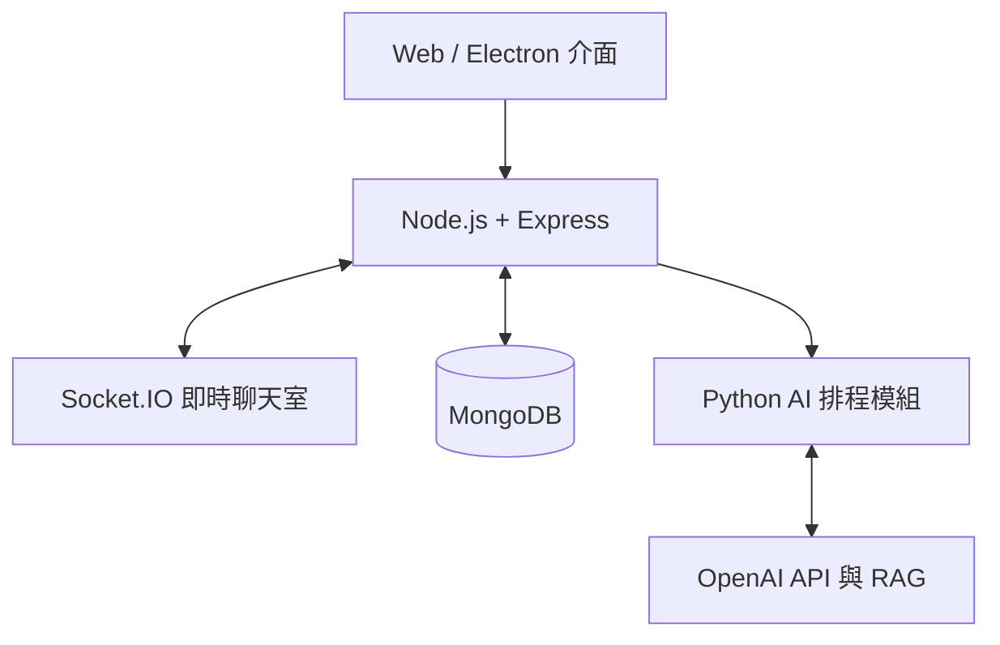

# AI 智慧協作排程系統

這是我的大學專題，主要想解決多人安排活動時，需要一直從大量群組訊息中整理日期、時間與事件的問題。系統結合多人聊天室、AI 對話分析、行事曆與任務管理，讓使用者可以一邊討論，一邊把對話中的排程資訊整理成實際任務。

## 專題功能

- 建立群組或透過群組 ID 加入其他人的群組
- 使用 Socket.IO 進行多人即時聊天
- 從群組對話中辨識日期、時間與事件內容
- 使用 AI 助理依照使用者需求提供排程建議
- 將 AI 建議快速加入任務與行事曆
- 新增、編輯、完成或刪除個人任務
- 透過偏好表單記錄可用時段、專注時段與任務類型
- 使用 RAG 補充時間脈絡與過去任務經驗

## 系統架構



前端負責聊天室、行事曆、任務操作與使用者偏好表單；後端提供帳號、群組與任務 API，並將對話內容交給 Python 模組分析，再把排程建議回傳到系統中。

## 使用技術

| 類別 | 技術 |
| --- | --- |
| 前端 | HTML、CSS、JavaScript |
| 後端 | Node.js、Express |
| 即時通訊 | Socket.IO |
| 資料庫 | MongoDB、Mongoose |
| AI 與排程 | Python、OpenAI API、LangChain、RAG |
| 桌面應用 | Electron |

## 我的負責內容

我在專題中主要負責 Node.js 後端與 MongoDB 資料庫，包含帳號、群組、聊天紀錄與任務資料的串接；AI 排程部分則與組員共同設計與實作。開發過程中，我們發現語言模型對相對時間的理解不一定穩定，因此加入 RAG，讓模型在提出建議前能取得使用者偏好、既有行程與相關對話脈絡。

## 安裝與執行

建議先準備 Node.js 18 以上、Python 3.10 以上、MongoDB 資料庫與 OpenAI API Key。

1. 安裝 Node.js 套件

   ```bash
   npm install
   ```

2. 建立 Python 虛擬環境並安裝套件

   ```bash
   python -m venv .venv
   pip install -r requirements.txt
   ```

3. 複製 `.env.example` 為 `.env`，填入自己的設定

   ```env
   OPENAI_API_KEY=你的_OpenAI_API_Key
   MONGODB_URI=你的_MongoDB_連線字串
   PORT=3000
   PYTHON_BIN=python
   ```

4. 啟動 Web 版本

   ```bash
   npm run server
   ```

   瀏覽器開啟 `http://localhost:3000`。

5. 若要使用 Electron 桌面版本

   ```bash
   npm start
   ```

若需要建立 RAG 測試用的歷史任務，可先在 `.env` 設定 `SEED_TARGET_USER_NAME`，再執行 `node sendHistoryTask.js`。這支程式只會加入不重複的示範資料。

## GitHub 展示建議

README 最前面可以放一張「登入後的大廳總覽」，接著放聊天室與 AI 排程結果、行事曆任務管理、偏好設定表單三張功能圖。若有錄影，建議控制在 60 到 90 秒，依序展示登入、建立或加入群組、兩個帳號即時聊天、AI 擷取排程、加入任務與完成任務。

> 請勿將 `.env`、API Key、MongoDB 帳密、`node_modules` 或 `.venv` 上傳至 GitHub。
